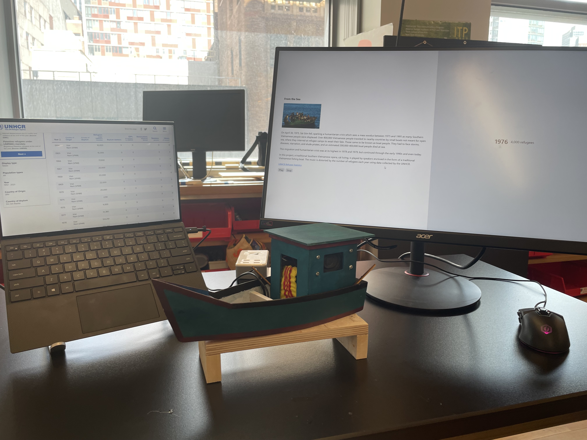
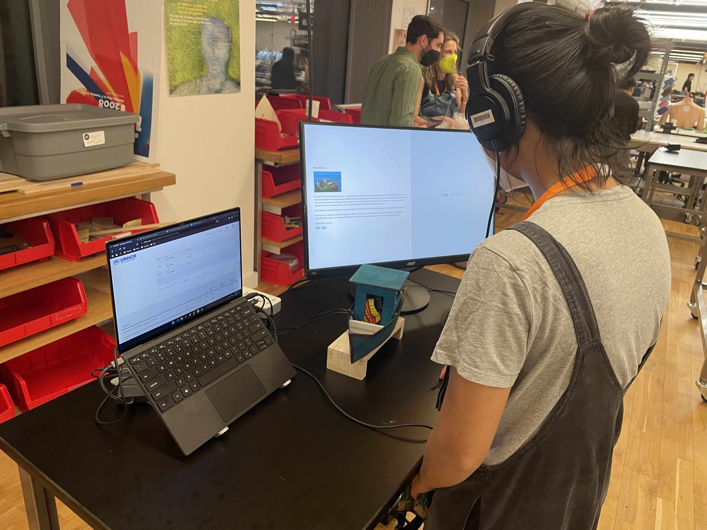
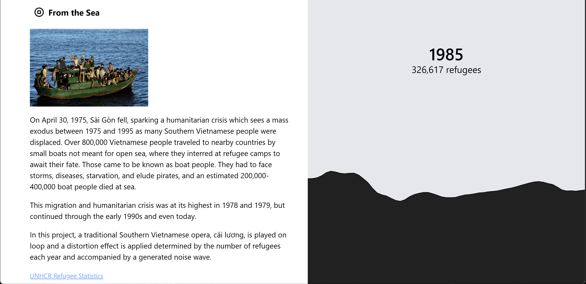

# Vietnamese Refugee Data Sonification

_From the Sea_ is a data sonifcation project that uses data from the [UNCHR](https://www.unhcr.org/refugee-statistics/download/?url=CwE2k9) of worldwide statistics of Vietnamese refugees to create a data driven piece.

I use audio from a famous cai luong song, named [Ong Lao Cheo Do](https://www.youtube.com/watch?v=Hob1EQWBV5o), about a man on a river. Using Tone.js, I play the file and read the number of recorded refugees each year to modify the level of distortion applied to the file.

On the web page, I have a brief text and image to describe the project and give contextual information about the refugee crisis. On the right of the project I display the year and number of recorded refugees. Below I display a wave form generated with Perlin noise and map the output to the refugee data as well. This gives an effect where the more recorded refugees there were the greater the noise wave.

For exhibition, I accompany the audio visual display, with a miniature boat of a traditional fishing boat which were used by thousands of Vietnamese in search of a better future. I used electronics and installed speakers to emit the audio.

Check out the project at the [webpage](https://emceelamb.github.io/viet-refugee-sonification).

View the documentation from the [exhibition](https://player.vimeo.com/video/945606906?h=3043875633).

